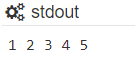

# 입출력과 변수, 주석

입력, 출력, 변수, 주석 대한 글입니다.

출력, 변수, 입력, 주석순으로 글을 작성하였습니다.

입출력

* [x] 기본 입출력 - 현재 글
* [ ] 다양한 출력 방법
* [ ] 자주 사용하는 모듈\(sys.stdin.readline\)

## 출력

파이썬에서 쓰이는 출력 함수는 print\(\)입니다.

```python
print()
```

이 print\(\)에서 괄호 사이에 숫자나 문자, 혹은 나중에 list, dict 등등을 집어 넣어서 출력을 하게 만들 수 있습니다.

```python
print(1)
```

위와 같이 print\(1\)을 입력하여 실행할 경우


1을 출력할 수 있습니다.

```python
print(1, 2, 3, 4, 5)
```

이렇게 여러 개의 숫자를 출력할 경우



콤마 없이 1 2 3 4 5가 출력이 됩니다.

```python
print('abcd')
print("abcd")
```

문자열의 경우 숫자 출력과 다르게 위와 같이 따옴표를 사용해서 따옴표 안에 문자열을 넣어서 출력을 해야 합니다.

이때 따옴표는 작은 따옴표, 큰 따옴표 상관이 없습니다.


따옴표 안에 들어가 있는 내용들이 전부 출력이 되기 때문에 위에서 숫자들을 출력할 때 사용한 코드를 따옴표 안에 넣고 출력하면 숫자를 출력할 때와 다르다는 것을 알 수 있습니다.

```python
print(1, 2, 3, 4, 5)
print('1, 2, 3, 4, 5')
```




서울의 오늘 날짜를 출력하는 문제입니다. 제가 지금 글을 작성하고 있는 시간이 2021년 3월 6일이므로 2021-03-06을 출력하면 되는 문제입니다. 여기서 2021과 03 사이, 03과 06사이에 숫자가 아닌 문자 -\(하이픈\)이 들어가 있기 때문에 숫자가 아닌 문자열로 출력을 해야 합니다.

```python
print('2021-03-06')
```


* [https://www.acmicpc.net/problem/2557](https://www.acmicpc.net/problem/2557)
* [https://www.acmicpc.net/problem/7287](https://www.acmicpc.net/problem/7287)
* [https://www.acmicpc.net/problem/11942](https://www.acmicpc.net/problem/11942)
* [https://www.acmicpc.net/problem/9653](https://www.acmicpc.net/problem/9653)
* [https://www.acmicpc.net/problem/16170](https://www.acmicpc.net/problem/16170)


## 변수

변수는 아직 알려지지 않거나 어느 정도까지만 알려져 있는 양이나 정보를 저장할 수 있는 공간이라고 합니다.

변수는 사람으로 예시를 들면 기억을 담당하는 곳이라고 생각하면 됩니다. 우리가 숫자를 1개 입력 받아 해당 숫자의 제곱을 출력하는 문제를 풀고 있다고 가정해봅시다.

만약 3이라는 값을 입력 받으면 우리는 3을 기억하고, 이 기억한 3을 제곱하여 9를 답이라고 말할 수 있게 됩니다. 컴퓨터도 마찬가지입니다. 만약 3이라는 값을 입력 받으면 컴퓨터는 3을 변수에 저장하고, 변수에 저장한 3을 제곱하여 9를 출력하는 것입니다.

변수 이름은 보통 문자, 문자 + 숫자로 사용하는 편입니다. 변수 값을 설정할 때는 입력 할 때와 마찬가지로 숫자는 따옴표 없이 가능하고, 문자열을 저장할 때는 따옴표를 사용해야 합니다. 

```python
a = 123
b = 'abcd'
abc123 = '1, 2, 3, 4'
xyz_123 = 'hello'
Jeong_Da_Been = 'department of software engineering'
```

위 예시를 그대로 이용해봅시다. 3을 변수에 입력해서 9를 출력하려면 다음과 같은 소스를 만들어야 합니다.

```python
a = 3
print(a * 3) # * = 곱셈
print(a ** 2) # ** = 거듭제곱
```


위 코드에 \*, \*\*가 나왔는데 사칙연산, 몫과 나머지, 거듭제곱 다 할 수 있습니다. 기호들은 대부분 평소에 보았을 것이라고 생각합니다. 다른 부분도 있지만 일단 당장 필요한 기능은 7가지입니다. 추가로 절대값은 abs\(\)라는 함수를 사용합니다.

```python
1 + 2 #덧셈
1 - 2 #뺄셈
1 * 2 #곱셈
1 / 2 #나눗셈
1 // 2 #몫
1 % 2 #나머지
2 ** 2 #2의 제곱
abs(-3) # |-3| = 3
```


## 입력

알고리즘 문제를 풀 때에는 모든 입력 값을 보여주지 않습니다. 설령 모든 데이터가 주어진다고 해도 데이터의 개수가 보통 백단위 ~ 만단위이기 때문에 모든 값을 변수에 저장해서 코드를 짤 수는 없습니다.

그래서 우리는 다양한 입력 값을 저장 할 수 있는 변수를 선언한 다음, 값을 변수에 저장해두고 해당 입력 값에 맞는 답을 출력하도록 처리해줘야 합니다.

중학교, 고등학교 때 배우는 수학책에서 나오는 아래 함수 그림과 똑같다고 생각하시면 됩니다.


a는 입력 값, f\(x\)는 우리가 코드를 짜는 주요 내용, f\(a\)는 출력 값입니다.

입력 받는 방법은 이번 글에서는 3가지를 배울 예정입니다.

### 1개만 입력 받을 때

```python
a = input() #문자열
b = int(input()) #정수
c = float(input()) #소수점을 가진 숫자
```

먼저 input\(\)은 하나의 변수만 입력 받아서 값을 저장할 수 있는 방법입니다. input\(\)은 그중에서도 문자열로 입력을 받아 변수에 저장하는 것이며, 정수를 저장한다면 int\(input\(\)\), 유리수를 저장한다면 float\(input\(\)\)으로 값을 받을 수 있습니다.

여기서 int, float가 나오는데 이건 변수 타입이라고 합니다.

int형이면 정수일 것이고, float형이면 소수점이 있는 숫자라고 생각하시면 됩니다.  float형은 보통 나눗셈\(/\)를 사용할 때 4/2를 출력하면 2.0인 float형으로 저장이 됩니다. 그래서 정수값이 나올 수 있는데 float형이 나온다면 4//2를 사용해야 합니다. 문자열의 경우에는 str로 사용하고 있습니다.

그래서 만약 1을 문자열로 입력 받았는데 여러가지 타입으로 바꾸고 싶다면 아래처럼 사용하면 됩니다.

```python
a = '1'
a = int(a) #a = '1'에서 a = 1로 변경
a = float(a) # a = 1에서 a = 1.0으로 변경
a = str(a) # a = 1.0에서 a = '1'로 변경
```

위 코드처럼 int, float를 사용하여 바꾸다가 다시 str을 적용하면 문자열로 바꿀 수 있습니다.


이번엔 위에서 언급한 3을 입력 받아 제곱으로 출력하는 프로그램보다 더 발전된 프로그램인 정수 1개를 입력 받아서 제곱을 출력하는 프로그램을 만들어봅시다.

```python
a = int(input())
print(a * a)
print(a ** 2)
```




이 문제를 풀어 봅시다.

1부터 10,000사이의 숫자 n을 입력 받아서 1부터 n까지의 합을 출력하라는 문제입니다.

이 문제는 1부터 n까지의 합을 구하는 공식을 알고 있어야 풀 수 있는 문제입니다. 다른 방법으로도 문제를 풀 수 있지만 여기서는 수학 공식을 이용하여 문제를 풀 것 입니다.

$$
\frac{n(n+1)}{2}
$$

이것을 코드로 표현하면 아래와 같습니다.

```python
n * (n+1) // 2
```

/가 아닌 //를 사용하는 이유는 변수 파트에서 언급한대로 /를 사용하면 자동적으로 float형이 나오기 때문에 소수점까지 출력하게 됩니다. 그래서 //를 사용하여 정수를 출력하게 만들어야 합니다. 

Q\) 2를 나누면 값이 정수가 아닌 유리수인 경우도 있으니까 몫으로는 정확한 값을 구할 수 없지 않을까요?

A\)  n이 홀수이면 n+1은 짝수이고, n이 짝수이면 n+1은 홀수일 것 입니다. 그리고 \(홀수\) \* \(짝수\) = \(짝수\)이기 때문에 소수점이 나오는 경우는 없습니다.

이제 n을 입력 받고 값을 출력하면 됩니다.

```python
n = int(input())
ans = n * (n+1) // 2
print(ans)
```


풀어볼 문제

* [https://www.acmicpc.net/problem/2558](https://www.acmicpc.net/problem/2558)
* [https://www.acmicpc.net/problem/16394](https://www.acmicpc.net/problem/16394)
* [https://www.acmicpc.net/problem/18108](https://www.acmicpc.net/problem/18108)
* [https://www.acmicpc.net/problem/2935](https://www.acmicpc.net/problem/2935)


### 여러 개를 입력 받을 때



이 문제를 읽어봅시다. 2558번과 다르게 이 문제는 한 줄로 A와 B의 값을 받고 있다는 것을 알 수 있습니다.

이렇게 한 줄로 입력 값이 주어졌는데, 변수를 여러 개로 나눠야 한다면 아래 코드와 같은 함수를 이용하여 한 줄로 입력을 받은 것을 여러 개의 변수에 저장할 수 있습니다.

```python
input().split() #문자열
map(int,input().split()) #숫자들
```

split은 단어 그대로 나누는 의미를 가지고 있으며 기본 값은 split\(' '\)로 공백을 기준으로 입력 값을 나눕니다. 만약 공백이 아니라 입력 값이 1-2-3, a-b-c, x-1-y 같이 -로 나눠야 한다면 input\(\).split\('-'\)가 됩니다.

map\(int, input\(\).split\(\)\)에서 int 대신 유리수가 들어온다면 float로 변경할 수 있고, 문자열로 입력 받고 싶으면 int대신 str을 넣으면 됩니다. 그런데 문자열은  input\(\).split\(\)으로 입력 받을 수 있어서 굳이 사용할 이유가 없습니다.

이제 위의 문제를 풀어본다면 A와 B는 숫자이므로 A, B는 map\(int,input\(\).split\(\)\)으로 값을 받고 A+B를 출력하면 됩니다.

```python
A, B = map(int, input().split())
print(A + B)
```

```python
A, B = map(int, input().split())
C = A + B
print(C)
```

위 코드처럼 바로 A+B를 출력할 수도 있고, C라는 변수에 저장하여 C를 출력하게 만들 수 있습니다. 본인이 편한대로 사용하시면 됩니다.

그리고 문자열로 입력 받은 후에 int형으로 바꾸는 방법도 있습니다.

```python
A, B = input().split()
print(int(A) + int(B))
```

또 다른 문제를 풀어봅시다.



이 문제는 n \* m 크기로 만들어진 경기장에서 왼쪽 위부터 티켓 번호 순서대로 자리에 앉을 때, k번 티켓을 가지고 있는 욱제가 앉아야 하는 좌석의 좌표를 출력해야 하는 문제입니다.

예제 1번을 보면 n = 3, m  = 4, k = 6인데 본문에 나와있는 사진을 보면 첫 번째 줄은 0, 1, 2, 3이고, 두 번째 줄은 4, 5, 6, 7이고, 세 번째 줄은 8, 9, 10, 11인 것을 보면 6번 티켓의 자리는 \(1, 2\)인 것을 알 수 있습니다.

예제 2번도 생각해보면 n = 6, m = 4, k = 14인데, 한 줄마다 4개의 좌석이 있고 티켓은 0부터 시작하므로

0, 1, 2, 3

4, 5, 6, 7

8, 9, 10, 11

12, 13, 14, 15

....

로 4번째 줄 3번째 칸인 \(3, 2\)가 답인 것을 알 수 있습니다.

이 문제에서 캐치 할 수 있는 것은 관중석은 총 n줄이 있고, 한 줄에 m개의 좌석이 있다는 것을 알 수 있습니다. 거기다가 0일 때는 \(0, 0\), 1일 때는 \(0, 1\), 2일 때는 \(0, 2\), 3일 때는 \(0, 3\), 4일 때는 \(1, 0\), 5일 때는 \(1,1\), 8일 때는 \(2, 0\), 12일때는 \(3, 0\)인 것을 보면 몫과 나머지로 구할 수 있습니다.

x좌표는 k를 m으로 나눈 몫이 되겠고, y좌표는 k를 m으로 나눈 나머지가 될 겁니다.

이 생각이 맞는지 예제를 다시 풀어봅니다. 예제 1번은 n = 3, m = 4, k = 6인데 k = 4 \* 1 + 2로 \(1, 2\)가 답이 맞습니다. 예제 2번은 n = 6, m = 4, k = 14인데 k = 4\*3 + 2 이므로 \(3, 2\)가 답이 맞습니다.

이제 일반화된 식을 구했으니 코드를 만들어서 답을 구할 수 있게 됩니다.

```python
n, m, k = map(int, input().split())
x = k // m
y = k % m
print(x, y)
```

풀어볼 문제

* [https://www.acmicpc.net/problem/2420](https://www.acmicpc.net/problem/2420)
* [https://www.acmicpc.net/problem/3046](https://www.acmicpc.net/problem/3046)
* [https://www.acmicpc.net/problem/16430](https://www.acmicpc.net/problem/16430)
* [https://www.acmicpc.net/problem/10869](https://www.acmicpc.net/problem/10869)
* [https://www.acmicpc.net/problem/3003](https://www.acmicpc.net/problem/3003)

### 

### 빠른 입력 받기

```python
import sys

a = sys.stdin.readline()
```

sys 모듈을 이용하여 빠르게 입력을 받을 수 있습니다.

문자열은 엔터 키를 누르면 생기는 줄 바꿈 문자\('\n'\)까지 저장되어서 맨 오른쪽, 맨 왼쪽의 공백과 줄 바꿈문자를 제거하는 strip\(\)함수를 사용해야 합니다.

맨 오른쪽 공백, 줄 바꿈만 제거하는 함수는 rstrip\(\), 맨 왼쪽 공백, 줄 바꿈만 제거하는 함수는 lstrip\(\)가 있습니다. strip\(\)는 양쪽 공백, 줄 바꿈을 제거합니다.

```python
#숫자
input = __import__('sys').stdin.readline
x = int(input())
a, b = map(int,input().split())

#문
input = __import__('sys').stdin.readline
x = input().strip()
a, b = input().strip().split()
```

저는 위와 같이 사용하여 input\(\)이라는 이름을 그대로 사용합니다.

## 주석

주석은 문제를 풀면서 메모를 해두는 기능이라고 생각하시면 편합니다. 주석은 코드를 실행할 때 영향을 전혀 끼치지 않습니다.

주석은 총 두 가지의 방법이 있습니다.

첫 번째로 \#을 이용하는 것입니다.

```python
n = int(input())
print(n * (n+1) // 2) # 1부터 n까지의 합을 출력함

# 가나다라
# abcd
```

\#을 이용하면 한 줄에만 주석 처리를 할 수 있습니다.

두 번째로는 ''' ''', """ """과 같이 따옴표 3를 이용하는 것입니다.

따옴표 3개는 \#과는 달리 따옴표 안에 들어가는 전체 내용이 주석으로 처리됩니다.

```python
'''print("hello")'''

print('bye')


"""            

                  asdfdsa 
                  
                            """
```

 

